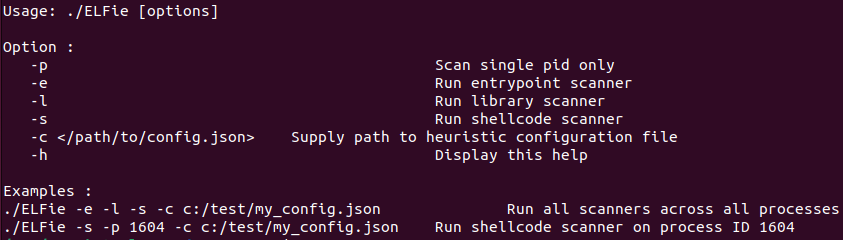

## BlackHat Asia 2024 Arsenal 
This tool was presented at:  
https://www.blackhat.com/asia-24/arsenal/schedule/index.html#elfiescanner-advanced-process-memory-threat-detection-on-linux-37672

---
 <br>
#

A C++ POC for advanced process memory scanning that attempts to detect a number of malicious techniques used by threat actors & those which have been incorporated into open-source user-mode rootkits.

ELFieScanner inspects every running process (both x86/x64) and its corresponding loaded libraries to look for evil. It then outputs the resultant telemetry into a NDJSON file. ELFieScanner offers four main scanner capabilities to look for:

- Shared Object injection techniques.
- Entry point manipulation techniques.
- Shellcode injection & Process hollowing.
- API hooking.

Each technique ELFieScanner looks for is displayed within `config.json`. This config file provides the user with the ability to switch on/off each heuristic and also modify the fuzzy hash thresholds required to generate any output files. 

ELFieScanner will produce three output files, one for each scan type in the format `hostname_scannerType_output_arch.json`. Events will only be generated for processes that have fired on one or more of the heuristics.

Kibana mappings have also been provided for the output files should one wish to index the data to make threat hunting analysis easier. These can be found in the `elk_mappings` folder.

**A more detailed description of each scanning type can be found in the <mark>Scanner descriptions</mark> section of this README.**

## Usage:
 <br>

NOTE: By not including the flag '-p' ELFieScanner will default to scanning all running processes on host.

### Configuration & Heuristics

Each heuristic is prepended with the initials of which scanner type it belongs to:
- `es` Entrypoint scanner.
- `ls` Library scanner.
- `ss` Shellcode scanner.

To turn on a heuristic set the value to `true`. To turn off a heuristic set the value to `false`. 


| Heuristic | Description |
| ----------- | ----------- |
| es_section_hdr_missing | Section headers can been stripped from a binary (this is suspicious but not necessarily malicious). Stripping the section headers makes reverse engineering of the binary more difficult. However it could be done make the binary smaller. The e_shoff This member holds the section header table's file offset in bytes. If the file has no section header table, this member holds zero. |
| es_phdr_wrong_location | Check to see if if the program headers start in the expected place (immediately after the ELF32_Ehdr/ELF64_Ehdr) e.g. 64 bytes offset for 64-bit, or 52 bytes offset for 32-bit. |
| es_proc_missing_disk_backing | Check the process is not backed by disk executable. More of an anomaly rather than a detection. |
| es_proc_text_segment_missing_disk | Check to see if the .text segment is present on disk. This should always be present unless the binary is still packed/obfuscated in memory. |
| es_proc_text_segment_missing_mem | Is the .text segment is present in memory. This should always be present unless the disk backed binary is packed/obfuscated. |
| es_proc_entry_points_not_in_text | Check to see if the e_entry field does NOT point within the .text segment. This should always be the case apart from special cases such as ‘VBoxService’. |
| es_proc_entry_points_not_matching | Check to see if the e_entry values for process & disk binary match. |
| es_proc_entry_fuzzy_score | Check the e_entry for the libc linked process matches the expected initialization code for ‘libc_start_main’. Highly suspicious unless this is for an interpreter process e.g. ‘/usr/bin/python’ OR container processes ‘/usr/sbin/VBoxService’. If the real score is below es_proc_entry_fuzzy_score then result will be generated. Set fuzzy score threshold (0-100)  |
| es_proc_init_fini_not_in_text | If either: <br /> 1. A process init/fini sections that don't appear in .text segment <br /> 2. A process preinit/init/fini array functions that don't point within the .text segment. |
| es_proc_init_not_at_text_start | For processes it is expected the .init code block should begin at the start of the .text segment. NOTE: this is not expected for modules. |
| es_mod_missing_disk_backing | Check to see if module is backed by disk executable. More of an anomaly rather than a detection. Check against every module. |
| es_mod_entry_points_not_in_text | Check the e_entry field points within .text segment of the module. This should always be the case for modules. Check against every module. |
| es_mod_entry_points_not_matching | Check to see the e_entry values for module and disk match. Check against every module. |
| es_mod_init_fini_not_in_text | Checks every module for : <br /> 1. module init/fini sections that don't appear in .text segment <br /> 2. module preinit/init/fini array functions that don't point within the .text segment.|
| ls_elf_in_anonymous_mapping | An ELF header found in an anonymous memory mapping. |
| ls_executable_anonymous_mapping | Executable anonymous memory mapping present. |
| ls_phdr_wrong_location | Program headers in wrong location. |
| ls_mod_missing_disk_backing | A module doesn't have disk backing. Checks for every module. |
| ls_module_not_in_procmaps | A module doesn't exist in /proc/pid/maps. Checks for every module. |
| ls_module_not_in_linkmap | A module doesn't exist in link_map structure. Checks for every module. |
| ls__libc_dlopen_mode_in_got | A Global Offset table (GOT) address points __libc_dlopen_mode func. |
| ls__libc_dlopen_mode_in_rodata | __libc_dlopen_mode string in rodata section. |
| ls_dtnull_missing | DT_NULL missing from dynamic section. |
| ls_dtdebug_missing | DT_DEBUG missing from dynamic section. |
| ls_dtneeded_incorrect_order | DT_NEEDED in non-sequential (incorrect) order in dynamic section. |
| ls_dynstr_manipulated | Dynamic string table manually manipulated. |
| ls_ldpreload_set | LD_PRELOAD populated. |
| ls_ldpreload_hooking | LD_PRELOAD hooking present. |
| ls_ldconfig_set | LD_CONFIG populated. |
| ls_ldpath_set | LD_PATH manipulated. |
| ls_dynamic_segment_missing | Dynamic segment missing. |
| ss_proc_missing_disk_backing | Process missing disk backed binary. |
| ss_proc_phdr_memory_disk_mismatch | The number of process program headers in memory should equal that of its corresponding disk binary. Any mismatch indicates a segment has either been added or taken away in memory. |
| ss_rwx_present_disk | Process memory contains a segment with Read/write & execute permissions. |
| ss_rwx_present_mem | Process binary contains a segment with Read/write & execute permissions. |
| ss_dynamic_segment_missing | Dynamic segment missing. Can indicate packing. |
| ss_memfd_mapping_found | Process loaded directly from memory using memfd_create() |
| ss_mod_missing_disk_backing | module missing disk backed binary. Check for all modules | 
| ss_mod_phdr_memory_disk_mismatch | The number of module program headers in memory should equal that of its corresponding disk binary. Any mismatch indicates a segment has either been added or taken away in memory. Check for all modules. |
| ss_mod_rwx_header_present_disk |  Module binary contains a segment with Read/write & execute permissions. Check for all modules. |
| ss_mod_rwx_header_present_mem | Module memory contains a segment with Read/write & execute permissions. Checks against all modules. |
| ss_proc_score | This measures the similarity between process disk & memory text (RX) segments. A low score indicates significant changes (and thus possible injection of code). If the real score is below ss_proc_score then result will be generated. Set fuzzy score threshold (0-100) |
| ss_lowest_mod_score | This measures the similarity between module disk & memory text (RX) segments. A low score indicates significant changes (and thus possible injection of code). If the real score is below ss_lowest_mod_score then result will be generated. Set fuzzy score threshold (0-100) |


## Installation
### Building a portable version using Holy Build box & requirements

Holy build box is a docker container aimed at building portable Linux binaries. It can be downloaded from `https://github.com/phusion/holy-build-box`.

To build this project using Holy build box simply run the `/holy-build-box_scripts/holy_build.sh` script from the root repo folder; making sure that docker in already installed on your local host.

Binaries work on pretty much any glibc-2.17-or-later-based x86_64 Linux distribution released since approx 2015. A non-exhaustive list:

-   Debian >= 8
-   Ubuntu >= 14.06
-   Red Hat Enterprise Linux >= 7
-   CentOS >= 7
            
### Building from source & requirements           

Standard g++ build commands can be found in tasks.json of vscode folder. 

glibc-2.17 or later x86_64.  
libfuzzy.so.2 - ssdepp fuzzy hasing library provided with source to statically compile if building from source.  
                           
### Build has been independently tested on following distros:

-   Centos 7
-   Debian 10
-   Fedora 33
-   Kali 5.10.0
-   Ubuntu 20.04.1

In addition the tool uses 8 threads all set to use the `SCHED_IDLE` policy. This is a policy designed for running very low priority background jobs.\\
The number of threads & the thread policy can be adjusted by changing the `THREAD_COUNT`, `THREAD_POLICY` values in `utils.h`

To limit CPU utilization the scanner has been restricted to only run on one core set by `NUM_CPU` constant in `utils.h`. Which is used by `set_cpu_affinity()` in `utils.cpp`.


                           
### Example output
Can be found in `sample_output` folder


## Description

Talk about ELF process vs Disk differences and rebuilding process required to perfrom accurate comparisions.

### Scanner descriptions

### Entrypoint Scanner
This scanner looks to identify the initialization and termination code in a running process. It analyses the .init, .init_array, .fini, .fini_array & preinit_array sections to determine if any these point to an area outside of the text segment. 
In addition it looks for suspicious entry points from the executable headers and whether they have been modified.  
The scanner not only scan the process itself but also every loaded module/shared object. 

#### Initialization Routines

Before transferring control to an application, the runtime linker processes any initialization sections found in the application and any loaded dependencies. The runtime linker executes functions whose addresses are contained in the .preinit_array and .init_array sections. These functions are executed in the same order in which their addresses appear in the array. The runtime linker executes an .init section as an individual function. If an object contains both .init and .init_array sections, the .init section is processed before the functions defined by the .init_array section for that object.

#### Termination Routines

A dynamic executable may provide pre-initialization functions in a .preinit_array section. These functions are executed after the runtime linker has built the process image and performed relocations but before any other initialization functions. Pre-initialization functions are not permitted in shared objects.
Dynamic objects can also provide termination sections. The termination sections .fini_array and .fini are created by the link-editor when a dynamic object is built.

Any termination sections are organized such that they can be recorded by atexit(). These routines are called when the process calls exit(2), or when objects are removed from the running process with dlclose(). The runtime linker executes functions whose addresses are contained in the .fini_array section. These functions are executed in the reverse order in which their addresses appear in the array. The runtime linker executes a .fini section as an individual function. If an object contains both .fini and .fini_array sections, the functions defined by the .fini_array section are processed before the .fini section for that object.

#### Registering initialization and termination routines

This can either be done directly using the link-editor with the flags -zinitarray & -zfiniarray g. 

    #include    <stdio.h>

    void foo()
    {
            (void) printf("initializing: foo()\n");
    }

    void bar()
    {
            (void) printf("finalizing: bar()\n");
    }

    main()
    {
            (void) printf("main()\n");
            return (0);
    }

    $ cc -o main -zinitarray=foo -zfiniarray=bar main.c

Or by using compiler primitives to simplify their declaration. For instance the pervious code can be rewritten using the following #pragma definitions

    #include    <stdio.h>

    #pragma init (foo)
    #pragma fini (bar)
    ........

    $ cc -o main main.c

#### The Entry point (e_entry) in the Elf64_Ehdr.

This is where the interpreter (typically ld-linux.so) will transfer control after it finishes loading the binary into virtual memory. Typically we would expect the entry point to point directly to the `_start` or `_main` function within the .text section. The scanner collects the e_entry from both the running process and its disk backed executable (if available) to ensure they match. It also checks to validate it points to within the .text segment in memory. 

In addition, if the binary of the process has been compiled & linked with `libc`, it means that the entry point will point to some special initialization code for `libc_start_main`, which sets up the process heap segment, registers constructors and destructors, and initializes threading-related data; after which it calls the processes main function. 

This initialization code can be seen below. It looks almost identical in every libc linked binary. 
The scanner takes a fuzzy hash of the code below and compares this against a fuzzy hash of the same number of bytes taken from the starting point at which e_entry points to.
Processes / modules with a low similarity score are highly suspicious!! 

Processes expected to use different initialization code include:

-   VirtualBox & other hypervisors
-   Snap 

```
    objdump -d --section=.text detectSC | grep -A 20 \_start

    0000000000004de0 <_start>:
        4de0:       f3 0f 1e fa             endbr64 
        4de4:       31 ed                   xor    %ebp,%ebp
        4de6:       49 89 d1                mov    %rdx,%r9
        4de9:       5e                      pop    %rsi
        4dea:       48 89 e2                mov    %rsp,%rdx
        4ded:       48 83 e4 f0             and    $0xfffffffffffffff0,%rsp
        4df1:       50                      push   %rax
        4df2:       54                      push   %rsp
        4df3:       4c 8d 05 46 37 02 00    lea    0x23746(%rip),%r8        # 28540 <__libc_csu_fini>
        4dfa:       48 8d 0d cf 36 02 00    lea    0x236cf(%rip),%rcx        # 284d0 <__libc_csu_init>
        4e01:       48 8d 3d b0 36 00 00    lea    0x36b0(%rip),%rdi        # 84b8 <main>
        4e08:       ff 15 c2 f1 03 00       callq  *0x3f1c2(%rip)        # 43fd0 <__libc_start_main@GLIBC_2.2.5>

```

### Library Scanner

The library scanner inspects every running process and its corresponding loaded libraries. It uses the .dynamic segment to manually rebuild the sections and imports from process memory, collects and relevant environmental variables, scans anonymous memory regions, cross references modules & determines load orders to detect the following: 

1. Anonymous memory mappings with executable permissions.
2. Anonymous memory mappings containing ELF magic bytes. (Only scans anonymous mappings that are 1MB or smaller defined in `MAX_SIZE_ANONYMOUS_MAPPING`, otherwise this significantly slows down the scanner).
3. Non-sequential and thus incorrect DT_NEEDED shared object link order in the dynamic segment. 
4. No DT_NULL entry present in the dynamic segment. 
5. LD_CONFIG environmental variable set for running process.
6. LD_CONFIG hooking of LIBC functions.
7. Loaded shared objects with no disk backed executable. 
8. Custom LD_LIBRARY_PATH set for running process.
9. Custom LD_CONFIG set for running process.
10. Global offset table (GOT) addresses which point to `__libc_dlopen_mode`.


### Shellcode scanner

detectSC inspects every running process and its corresponding loaded libraries. It extracts the pt_load segment containing the '.text' section from memory then finds the equivalent segment from the corresponding disk backed executable (if present). 
Using ssdeep it creates a fuzzy hash for each segment, then uses these to generate a similarity score (as a percentage) between disk and memory. 

In addition the tool:
- Searches for RWX segments in both memory and disk for both the process and it's loaded modules (quick & easy way to maliciously write & execute code)
- Checks to see whether the number of segments in memory matches the number of segments on disk for both the process and it's loaded modules. (Helpful to identify packed executables / processes with additional mapped segments added)

Process/libraries that have low similarity scores between disk & memory indicate code modification. This may be a result of the following:
- Malicious shellcode injected into a process/module by an attacker
- JIT (Just in Time) code compilation 
- Process is being debugged, and thus debugger has inserted breakpoint(s) (INT3 /0xcc) into the text segment in memory. 
- Packed executables that have unpacked themselves in memory 
- AV that has injected into running processes. 

To minimize unnecessary output the shellcode scanner allows one to omit results that have high similarity scores. 
ss_proc_score/ss_lowest_mod_score (0-100) is the minimum similarity percentage accepted for a result to be printed. 
If the minimum score qualifies the similarity result between the text segments will be printed to the results file. 

The shellcode scanner can generate lots information to stdout, common log messages pertain to:
- Processes/modules with no disk backed executables thus can't be compared. 
- Processes that have exiting midway through the scanner running.
- Snap applications

## Potential future enhancements
- Add whitelist
- Include scan summary report

## Credits
- Used the Json.hpp project for NDJSON file output - https://github.com/nlohmann/json.
- Borrowed and modified funcs to parse the /proc/pid/maps file - https://github.com/ouadev/proc_maps_parser/blob/master/pmparser.c.
- For building a portable binary - https://github.com/phusion/holy-build-box.
- For fuzzy hashing - https://github.com/ssdeep-project/ssdeep
